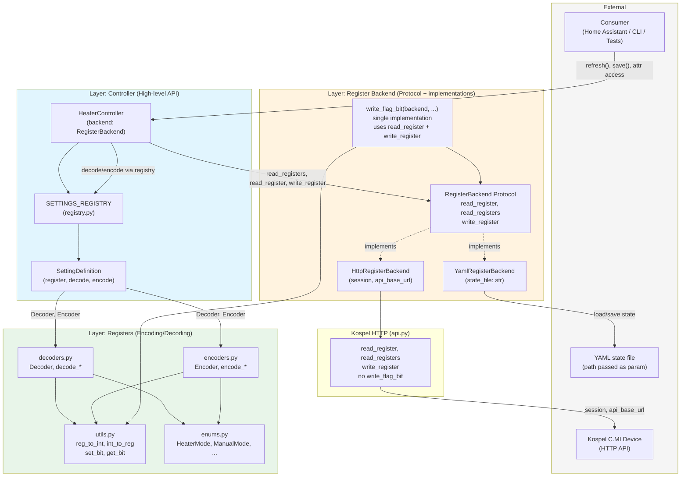
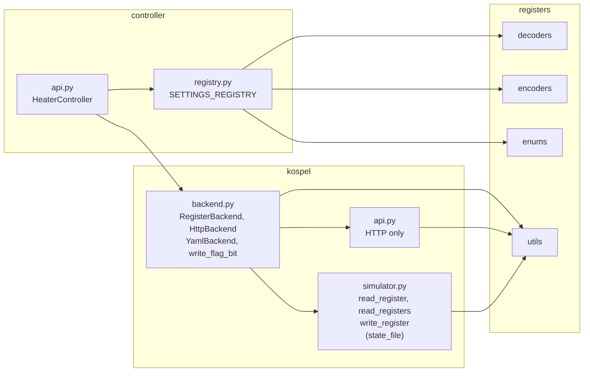

%% Project Architecture: kospel-cmi-lib
%% Communication layer for Kospel C.MI electric heater module.
%% Direction: Consumer → Controller → RegisterBackend (Protocol) → HTTP or YAML.

%% =============================================================================
%% Diagram 1: Full system — layers, external actors, data flow (primary view)
%% =============================================================================
%% Controller depends only on RegisterBackend. No simulation_mode or env vars
%% in the call chain. YAML path and API URL are constructor parameters of backends.

%% =============================================================================
%% Diagram 2: Package dependencies (controller → kospel → registers)
%% =============================================================================

%% =============================================================================
%% Design: Register backend abstraction
%% =============================================================================
%%
%% - HeaterController(backend: RegisterBackend, registry=...) — no session, no api_base_url, no simulation_mode.
%% - RegisterBackend Protocol: read_register(register), read_registers(start_register, count), write_register(register, hex_value).
%% - HttpRegisterBackend(session, api_base_url): implements Protocol via kospel.api HTTP calls.
%% - YamlRegisterBackend(state_file: str): implements Protocol via file load/save; state_file is a required parameter (no env var).
%% - write_flag_bit: single implementation (e.g. in backend.py), takes any RegisterBackend and uses read_register + set_bit + write_register; not part of Protocol; not duplicated in HTTP or YAML.
%% - No backward compatibility requirement: API is HeaterController(backend=...) only; consumer builds HttpRegisterBackend or YamlRegisterBackend explicitly.

## Architecture summary (for implementation)

- **Controller** (`controller/api.py`): `HeaterController(backend: RegisterBackend, registry=...)`. No `session`, `api_base_url`, or `simulation_mode`. Uses only `backend.read_register`, `backend.read_registers`, `backend.write_register` (and if needed, a standalone `write_flag_bit(backend, ...)`).
- **RegisterBackend Protocol** (`kospel/backend.py`): methods `read_register(register) -> Optional[str]`, `read_registers(start_register, count) -> Dict[str, str]`, `write_register(register, hex_value) -> bool`. No transport-specific parameters.
- **HttpRegisterBackend** (`kospel/backend.py`): constructor `(session: aiohttp.ClientSession, api_base_url: str)`. Implements Protocol by calling the HTTP-only functions from `kospel/api.py` (no decorators, no `simulation_mode`).
- **YamlRegisterBackend** (`kospel/backend.py`): constructor `(state_file: str)` — path required, no environment variable for file location. Implements Protocol using in-memory state and YAML load/save (logic from current `simulator.py` / `SimulatorRegisterState`).
- **write_flag_bit**: Single implementation only (e.g. in `kospel/backend.py`). Signature: accepts a `RegisterBackend` plus `register`, `bit_index`, `state`; implements read-modify-write via `backend.read_register` and `backend.write_register` using `reg_to_int` / `set_bit` / `int_to_reg`. Not a method of the Protocol; not implemented in `kospel/api.py` or duplicated in backends.
- **kospel/api.py**: Contains only HTTP logic: `read_register(session, api_base_url, register)`, `read_registers(...)`, `write_register(...)`. Remove `@with_simulator`, `simulation_mode` parameter, and `write_flag_bit` from this module.
- **kospel/simulator.py**: Function module: `read_register(state_file, register)`, `read_registers(state_file, ...)`, `write_register(state_file, ...)`. No classes; operations load/save the YAML file. Mirrors the structure of `api.py` (functions with “connection” param first).
- **Configuration**: No environment variables for simulation or YAML path. Consumer passes `api_base_url` for HTTP or `state_file` for YAML when constructing the backend.