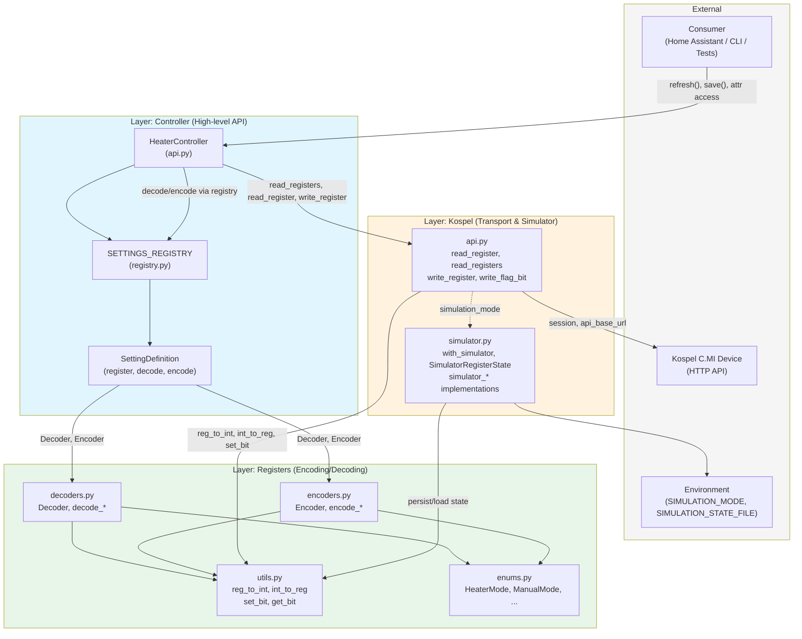
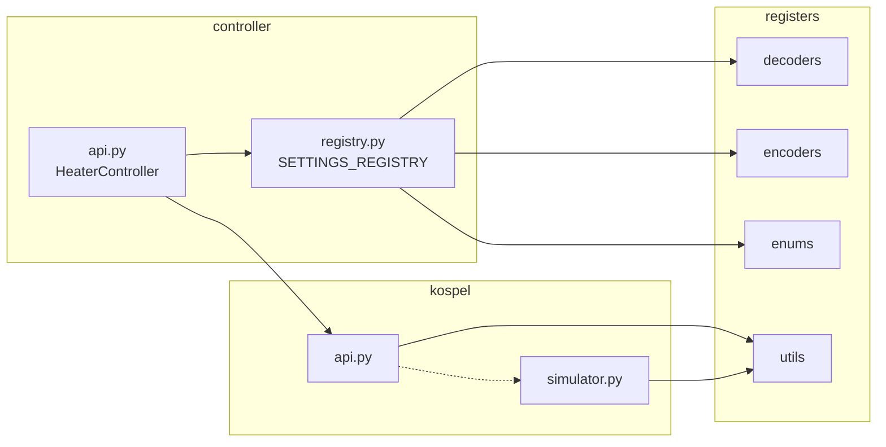

%% Project Architecture: kospel-cmi-lib
%% Communication layer for Kospel C.MI electric heater module.
%% Direction: Consumer → Controller → Kospel (API or Simulator) → Device / Env.

%% =============================================================================
%% Diagram 1: Full system — layers, external actors, data flow (primary view)
%% =============================================================================

%% =============================================================================
%% Diagram 2: Package dependencies only (controller → kospel → registers)
%% =============================================================================
