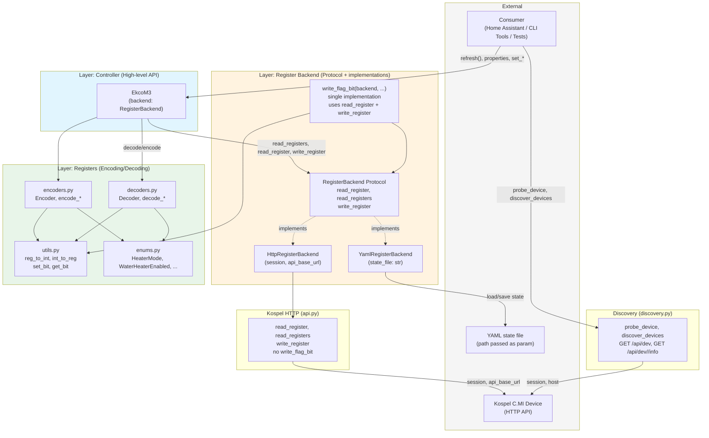
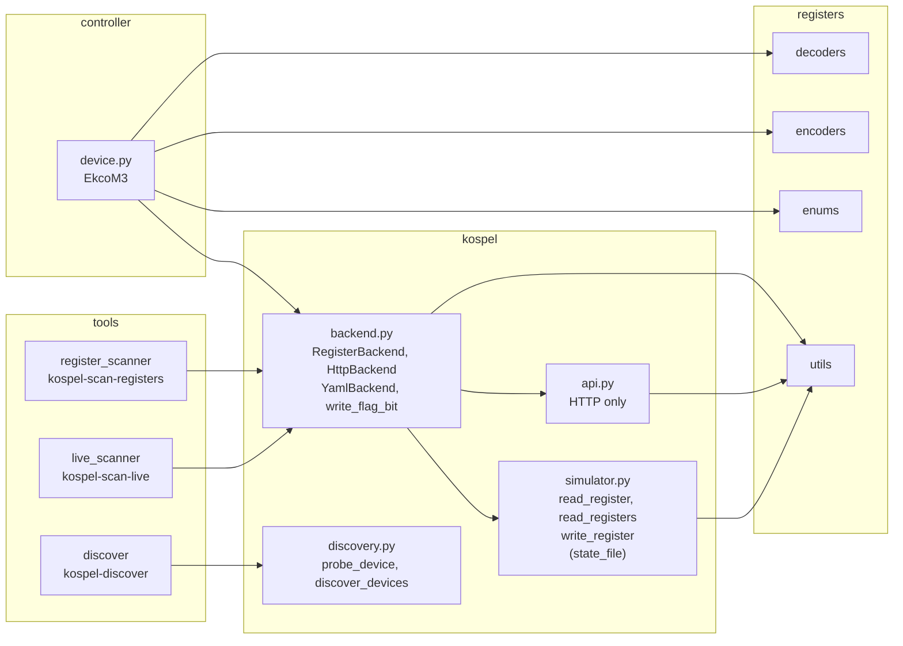

%% Project Architecture: kospel-cmi-lib
%% Communication layer for Kospel C.MI electric heater module.
%% Direction: Consumer → Controller → RegisterBackend (Protocol) → HTTP or YAML.

%% =============================================================================
%% Diagram 1: Full system — layers, external actors, data flow (primary view)
%% =============================================================================
%% Controller depends only on RegisterBackend. No simulation_mode or env vars
%% in the call chain. YAML path and API URL are constructor parameters of backends.

```mermaid
flowchart TB
    subgraph External["External"]
        Consumer["Consumer\n(Home Assistant / CLI Tools / Tests)"]
        Device["Kospel C.MI Device\n(HTTP API)"]
        YamlFile["YAML state file\n(path passed as param)"]
    end

    subgraph Controller["Layer: Controller (High-level API)"]
        direction TB
        HC["EkcoM3\n(backend: RegisterBackend)"]
    end

    subgraph BackendLayer["Layer: Register Backend (Protocol + implementations)"]
        direction TB
        Protocol["RegisterBackend Protocol\nread_register, read_registers\nwrite_register"]
        HttpBackend["HttpRegisterBackend\n(session, api_base_url)"]
        YamlBackend["YamlRegisterBackend\n(state_file: str)"]
        WriteFlagBit["write_flag_bit(backend, ...)\nsingle implementation\nuses read_register + write_register"]
        Protocol -.->|implements| HttpBackend
        Protocol -.->|implements| YamlBackend
        WriteFlagBit --> Protocol
    end

    subgraph KospelHTTP["Kospel HTTP (api.py)"]
        API["read_register, read_registers\nwrite_register\nno write_flag_bit"]
    end

    subgraph DiscoveryMod["Discovery (discovery.py)"]
        Discovery["probe_device, discover_devices\nGET /api/dev, GET /api/dev/<id>/info"]
    end

    subgraph Registers["Layer: Registers (Encoding/Decoding)"]
        direction TB
        Dec["decoders.py\nDecoder, decode_*"]
        Enc["encoders.py\nEncoder, encode_*"]
        Utils["utils.py\nreg_to_int, int_to_reg\nset_bit, get_bit"]
        Enums["enums.py\nHeaterMode, WaterHeaterEnabled, ..."]
        Dec --> Utils
        Dec --> Enums
        Enc --> Utils
        Enc --> Enums
    end

    Consumer -->|"refresh(), properties, set_*"| HC
    Consumer -->|"probe_device, discover_devices"| Discovery
    Discovery -->|"session, host"| Device
    HC -->|"decode/encode"| Dec
    HC --> Enc
    HC -->|"read_registers, read_register, write_register"| Protocol
    HttpBackend --> API
    API -->|"session, api_base_url"| Device
    YamlBackend -->|"load/save state"| YamlFile
    WriteFlagBit --> Utils

    style Controller fill:#e1f5fe
    style BackendLayer fill:#fff3e0
    style Registers fill:#e8f5e9
    style External fill:#f5f5f5
```

%% =============================================================================
%% Diagram 2: Package dependencies (controller → kospel → registers)
%% =============================================================================

```mermaid
flowchart LR
    subgraph L1["controller"]
        device["device.py\nEkcoM3"]
    end
    subgraph L2["kospel"]
        backend["backend.py\nRegisterBackend, HttpBackend\nYamlBackend, write_flag_bit"]
        kapi["api.py\nHTTP only"]
        simulator["simulator.py\nread_register, read_registers\nwrite_register\n(state_file)"]
        discovery["discovery.py\nprobe_device, discover_devices"]
    end
    subgraph L3["registers"]
        dec["decoders"]
        enc["encoders"]
        enums["enums"]
        utils["utils"]
    end
    subgraph L4["tools"]
        discoverCli["discover\nkospel-discover"]
        regScanner["register_scanner\nkospel-scan-registers"]
        liveScanner["live_scanner\nkospel-scan-live"]
    end
    device --> backend
    device --> dec
    device --> enc
    device --> enums
    backend --> kapi
    backend --> simulator
    backend --> utils
    kapi --> utils
    simulator --> utils
    discoverCli --> discovery
    regScanner --> backend
    liveScanner --> backend
```

%% =============================================================================
%% Design: Register backend abstraction
%% =============================================================================
%%
%% - EkcoM3(backend: RegisterBackend) — no session, no api_base_url, no simulation_mode.
%% - RegisterBackend Protocol: read_register(register), read_registers(start_register, count), write_register(register, hex_value).
%% - HttpRegisterBackend(session, api_base_url): implements Protocol via kospel.api HTTP calls.
%% - YamlRegisterBackend(state_file: str): implements Protocol via file load/save; state_file is a required parameter (no env var).
%% - write_flag_bit: single implementation (e.g. in backend.py), takes any RegisterBackend and uses read_register + set_bit + write_register; not part of Protocol; not duplicated in HTTP or YAML.
%% - Consumer creates EkcoM3(backend); no registry.

## Architecture summary (for implementation)

- **Controller** (`controller/device.py`): `EkcoM3(backend: RegisterBackend)`. Device-specific class with explicit properties and async setters. Uses `backend.read_register`, `backend.read_registers`, `backend.write_register`. Writes happen immediately (no save/batch).
- **RegisterBackend Protocol** (`kospel/backend.py`): methods `read_register(register) -> str`, `read_registers(start_register, count) -> Dict[str, str]`, `write_register(register, hex_value) -> None` (raises on failure). No transport-specific parameters.
- **HttpRegisterBackend** (`kospel/backend.py`): constructor `(session: aiohttp.ClientSession, api_base_url: str)`. Implements Protocol by calling the HTTP-only functions from `kospel/api.py` (no decorators, no `simulation_mode`).
- **YamlRegisterBackend** (`kospel/backend.py`): constructor `(state_file: str)` — path required, no environment variable for file location. Delegates to `simulator.py` (function module) for YAML load/save; no separate "state" class.
- **write_flag_bit**: Single implementation only (e.g. in `kospel/backend.py`). Signature: accepts a `RegisterBackend` plus `register`, `bit_index`, `state`; implements read-modify-write via `backend.read_register` and `backend.write_register` using `reg_to_int` / `set_bit` / `int_to_reg`. Not a method of the Protocol; not implemented in `kospel/api.py` or duplicated in backends.
- **kospel/api.py**: Contains only HTTP logic: `read_register(session, api_base_url, register)`, `read_registers(...)`, `write_register(...)`. Remove `@with_simulator`, `simulation_mode` parameter, and `write_flag_bit` from this module.
- **kospel/simulator.py**: Function module: `read_register(state_file, register)`, `read_registers(state_file, ...)`, `write_register(state_file, ...)`. No classes; operations load/save the YAML file. Mirrors the structure of `api.py` (functions with “connection” param first).
- **Configuration**: No environment variables for simulation or YAML path. Consumer passes `api_base_url` for HTTP or `state_file` for YAML when constructing the backend.
- **Discovery** (`kospel/discovery.py`): `probe_device`, `discover_devices` — no device_id required; uses `GET /api/dev` and `GET /api/dev/<id>/info` to find devices and obtain `api_base_url`.
- **Tools** (`tools/`): CLI entry points (`kospel-discover`, `kospel-scan-registers`, `kospel-scan-live`) and Python API; use `RegisterBackend` for register access (scanner tools) or `discovery` module for device discovery.
- **Consumer loads** `EkcoM3(backend)` — no registry; class is device-specific.